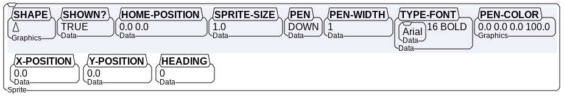

# Important Boxer Data Structures and Variables

This document describes important global variables, classes, and structures
in Boxer. It is not exhaustive of the source code, but tries to highlight the
most important items for debugging and development.

## Global Variables

## *initial-box*

boxer::*initial-box*

## *graphics-command-descriptor-table*

gdispl.lisp

Each turtle graphics operation is described by a graphics command. These are typically stored in lists on
graphics-sheets. Each command has an opcode followed by it's arguments.

## Box Classes and Structures

There are only a small handful of box types in the boxer system. These are:

- Data boxes
- Doit boxes
- Sprite boxes
- Graphics boxes
- Ports
- File boxes

For the most part all the properties for these different boxes lie in the main `defclass box`,
and marker classes are uses for doit, data, file, and port boxes. Whether a box is considered
a sprite or graphics box is determined by value of the `graphics-info` field in a box instance.

### box - defclass

boxdef.lisp

| Name                     | Type      | Description                           |
| -------------------------| --------- | ------------------------------------- |
| branch-links | d | a |
| cached-code | | |
| cached-rows | | |
| closets | | |
| contained-links | | |
| current-triggers | | |
| display-style-list | | |
| exports | symbol | If this value is `nil`, then the box will have a solid line and not export it's variables. If the value is `boxer-eval::.export-all-variables.` then it's a transparent box with the expected dashed lines. See `transparent.lisp` for more implementation details. |
| first-inferior-row | row | |
| flags | | |
| graphics-info | | |
| name | | |
| plist | | |
| ports | | |
| region | | |
| screen-objs | | |
| static-variable-cache | | |
| static-variables-alist | alist | A list of values for slots in certain box classes, notably sprites that map to boxes that can be seen in the actual boxer UI. See more on these below. |
| superior-row | | |
| tick | | |
| trigger-cache | | |
| virtual-copy-rows | | |
| | |
| oooooooooooooooooo | | |

#### static-variables-alist

The `static-variables-alist` is an alist containing values that are used internally but also kept in sync with boxes that are presented to users. For the most part these are values for sprites and graphics cursors consisting of:

- x-position
- y-position
- heading
- shown?
- pen
- pen-width
- type-font
- pen-color
- sprite-size
- home-position

Most of the functions for syncing and updating these are located in `grupfn.lisp`. (GRoup UPdate FunctioNs dot lisp). The framework and macros for working with these types of values are in `boxdef.lisp` under the "Box Interface Structures" portion.

### row - defclass

| Name                     | Type      | Description                           |
| -------------------------| --------- | ------------------------------------- |
| cached-chas | | |
| cached-chunks | | |
| cached-eval-objs | | |
| cached-evrow | | |
| cached? | | |
| chas-array | | |
| inferior-links | | |
| next-row | | |
| plist | | |
| previous-row | | |
| screen-objs | | |
| superior-box | | |
| tick | | |

### chas-array - simple vector

| Name                     | Type      | Description                           |
| -------------------------| --------- | ------------------------------------- |
| 0 - Vector of chas | vector | |
| 1 - length | integer | |
| 2 - BP's | list of boxer::bp | |
| 3 - BFD's | list of Boxer Font Descriptors | |

### bfd Boxer Font Description - defstruct

boxdef.lisp:655

The `boxer-font-descriptor` is used to describe the font used at various locations
in a row of text in a box.  The `cha-no` is the character in the row at which this
font begins (zero indexed).  The `font-no` is the internal boxer font id for the
font. This would include all the characteristics such as size and style in addition
to the font. The vector fonts themselves to do not contain any particular `color`,
which is the last item in this struct.

So, if the row of text contained 3 different font segments, there the row information
would store 3 of these, which `cha-no` being the location at which it's font starts
in the row.

The colors are currently pointers to lisp floats. TODO: Add more doco about this
structure.

| Name                     | Type      | Description                           |
| -------------------------| --------- | ------------------------------------- |
| cha-no | integer | |
| font-no | integer | |
| color | Pointer to type :LISP-SINGLE-FLOAT TODO| |

### screen-box defclass

disdcl.lisp:104

| Name                     | Type      | Description                           |
| -------------------------| --------- | ------------------------------------- |
| actual-obj | | |
| box-type | | |
| bps | | |
| cached-absolute-pos | | |
| display-style-list | | |
| force-redisplay-infs? | | |
| hei | | |
| max-scroll-wid | | |
| name | | |
| needs-redisplay-pass-2 | | |
| screen-row | | |
| screen-rows | | |
| scroll-to-actual-row | | |
| scroll-x-offset | | |
| scroll-y-offset | | |
| superior-screen-box | | |
| tick | | |
| wid | | |
| x-got-clipped? | | |
| x-offset | | |
| y-got-clipped? | | |
| y-offset | | |

### screen-row defclass

disdcl.lisp:93

| Name                     | Type      | Description                           |
| -------------------------| --------- | ------------------------------------- |

## Important macro definitions

These macros are used throughout the system for defining key pieces of re-usability and extension
in the architecture.

### defboxer-command

### defboxer-primitive

Allows writing primitives in a style similar to `defun` but obeys the evaluator's calling convention: pops arguments off VPDL stack, supports flavoured arguments, and pushes result onto VPDL stack.

### defrecursive-eval-primitive / defrecursive-funcall-primitive

Necessary for creating primitives that can evaluate Boxer code (`if`, `loop` etc.).
Such primitives can't call the evaluator, they must be split into before/after/cleanup parts; state between those parts may be kept in global variables that will get saved/restored in a custom PDL frame type that gets defined for each such primitive.

### defboxer-key
